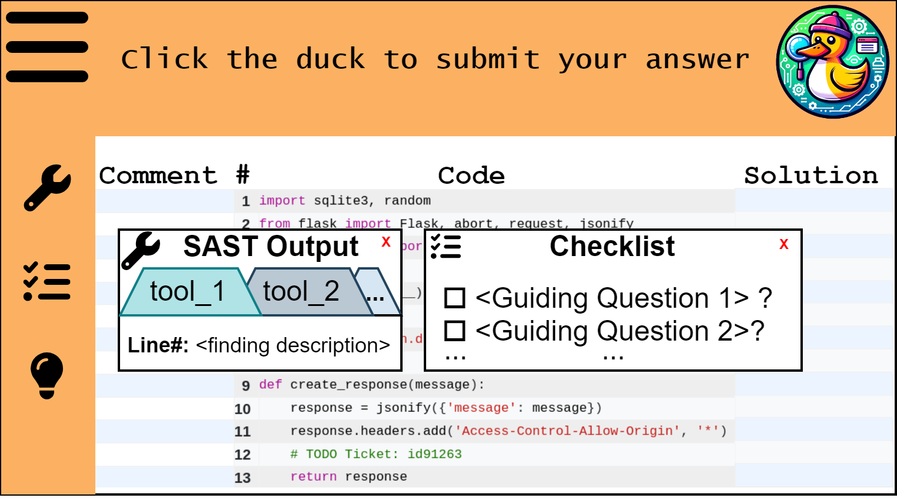
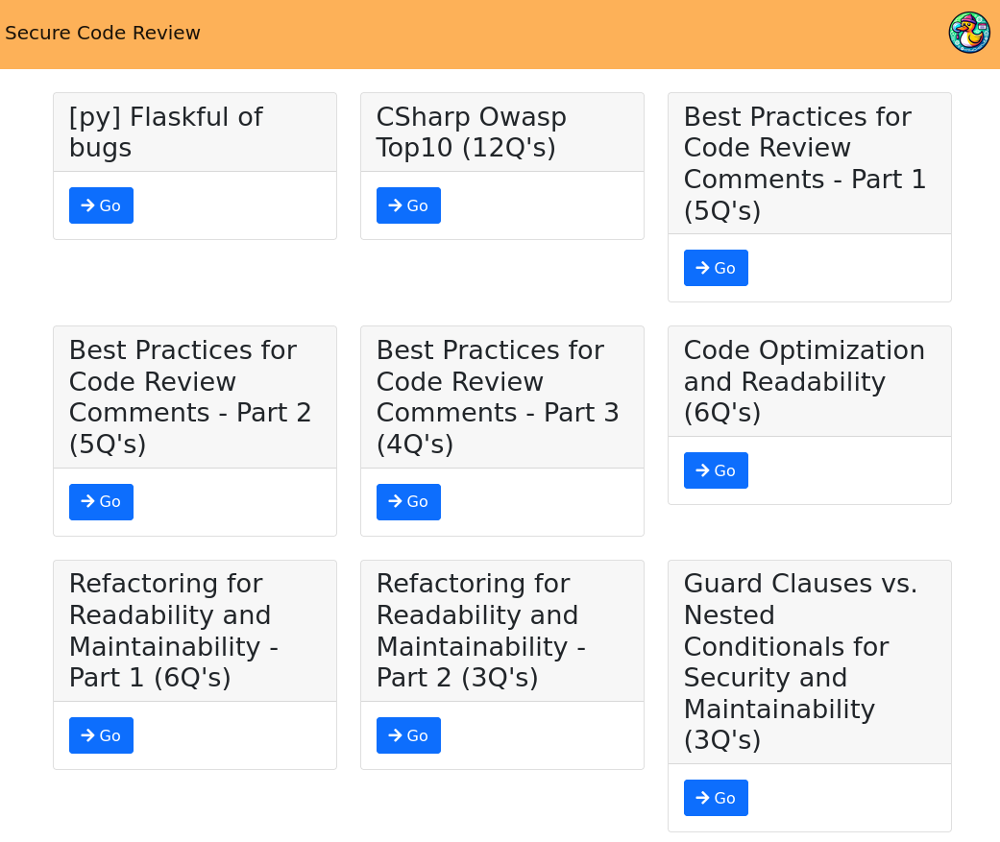
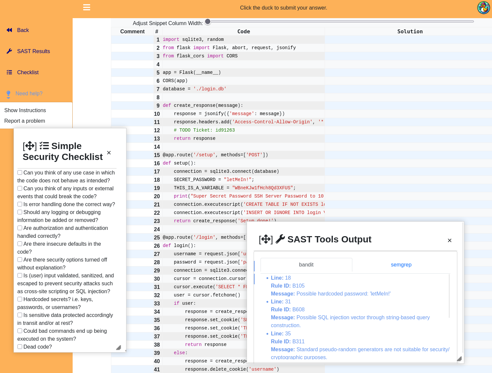
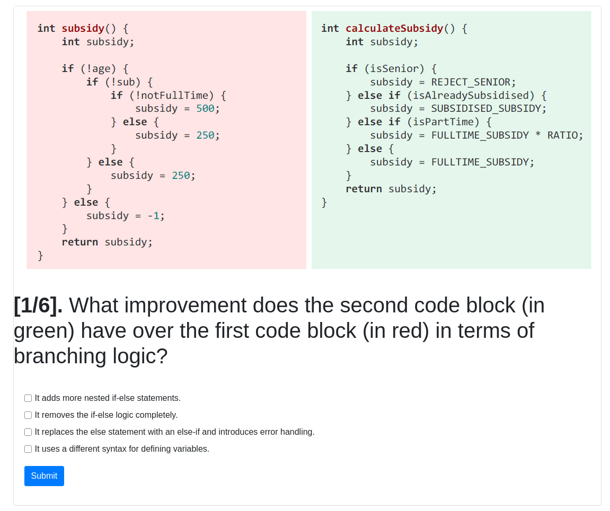

# DuckDebugger



The **DuckDebugger** is an educational game meant to teach software developers about secure coding and vulnerabilities -- by performing a security-centric code review, i.e., you just mark the code weaknesses you spot (e.g., non-filtered input, unchecked bounds, dangerous function calls, etc.).

- **How does it work?** You get access to a collection of challenges (exercises). Each exercise consists of the following: You get a short code snippet, and access to 2 sources of help:
    1. the output from static code analysis tools, for the given snippet
    2. a generic checklist about what you could look for
- **Your task:** Leave comments on the lines you think they have code weaknesses.
- **Your reward:** Once you find at least 50% of what we've hidden in the snippet, you get a flag and the full example solution.

**Intended audience:** Developers and testers who want exposure to software vulnerabilities.  
**Intended goal:** Gain security awareness.

The figure above shows the DuckDebugger interface mockup overlaid with a real challenge in the platform. You can already see two potential issues with the code in lines 11 (wildcard CORS policy) and 12 (comment with potential internal info leakage).

## Screenshots (with usecase descriptions)

<details>
  <summary>Landing Page</summary>

  - Shows a list of the included challenges (reviews and quizzes)

  

</details>

<details>
  <summary>Review Interface</summary>

  - Users must leave security-relevant comments on the given snippet.
  - **Provided help:** SAST outputs and generic checklist
  - **Solving criteria:** Comment on at least 50% of vulnerabilities 
    - Refer to [Customizing Evaluation Strategies with `diffAnswers`](#customizing-evaluation-strategies-with-diffanswers) for more details into how passing/failing is computed. You can customize this behavior, we've got 3 presets and a tunable threshold.
  - **Rewards:**
    - Flag (for CTF-like competitive deployments)
    - Full intented solution printed in the 3rd column.

  
  
</details>

<details>
  <summary>Quiz Interface</summary>

  - The DuckDebugger also has built-in support for administering quizzes.
  - Quizzes support inclusion of images.

  
  
</details>

## Quick start

**Prerequisites:** Please ensure that you have `make`, `python3` and `python3-venv` installed on your system:

```bash
sudo apt update && sudo apt install -y build-essential python3 python3-venv
```

### Deployment
Lean installation -- installs just the webapp (i.e. no SAST runtimes included).

After cloning this repository, run:

```bash
cd DuckDebugger/barebones_js
python3 -m venv venv
source venv/bin/activate
pip install --upgrade pip
pip install -r requirements.txt
./mockserver.py
```

---

## Developing and Contributing

For convenience, we've provided a script which installs everything required to develop further content for the platform. Includes runtimes and SAST tools for the currently supported languages.  

```bash
# There's some cleanup to be done here
cd install && make dev
```

**NOTE:** If you plan on developing only for certain programming languages, comment out what you **don't** want inside the `install/install.sh` file (in the `LANGUAGES` array).


**What you can do:**
* **Create (or update) challenges** (reviews & quizzes)
* **Tune evaluation** (how user answers are graded)
* **Extend programing language support**
* **Create your own quizzes**
* **Create your own surveys**
* **Work on the frontend** (webapp or REST-only backend)

### Creating a new challenge from a code snippet

See [docs/snippets_contribution.md](docs/snippets_contribution.md) for details about what a code snippet _needs_, in order to become a DuckDebugger challenge.

Currently supported languages: C, C++, C#, Golang, Javascript, Java, Python. See [docs/proglangs_contribution.md](docs/proglangs_contribution.md) for how to add support for new programming languages.

- The `genChalYaml.py` script (under `barebones_js/utils`) automates the process of adding new code review or quiz challenges to your workspace.
It takes a code snippet (from `barebones_js/snippets`) and does the necessary processing to generate:
    1. the necessary folder structure (symlinking the snippet into its challenge folder)
    2. solution files
    3. SAST outputs
    4. display-ready representation of the challenge (using `pygments`), and
    5. metadata for the new challenge, appended inside `barebones_js/exercises.yaml`.

**Example usage:**

```bash
# we've left the .c file in the snippets directory
# but didn't create a challenge, so you can try this out.
./genChalYaml.py c_CWE125.c "Read this somewhere"
```

- The first parameter (`c_CWE125.c`) is the filename of a code snippet located in snippets.
- The second parameter (`"Read this somewhere"`) is the display name for your new challenge.

#### Updating an existing challenge

Use the `--update` flag to modify an existing challenge, and see the script's help output for more options. **Example usage:**   

- `./genChalYaml.py <filename of snippet> <UUID from challenges.yaml> --update`  
  - e.g. `./genChalYaml.py python_flask.py e78749961806 --update` 
    - This snippet, with that UUID, exists -- feel free to experiment editing the snippet then running this update command to experiment with changes to a challenge in the DuckDebugger.

#### Removing a challenge
Handled via the `utils/removeChallenge.py` script.  
**Example usage:** `./removeChallenge.py <snippet_filename> [--keepSource]`

**But wait, there's more! (removing the last added challenge)**  
The `utils/undo_genChalYaml.sh` script acts as an "undo" button for a newly added challenge, in case that's needed. It **prompts for confirmation**, so we don't need an _undo the undo_ script.

It removes the most recent entry from `exercises.yaml` and deletes the latest rendered snippet file, helping you quickly revert an accidental or unwanted challenge addition. **Note:** This doesnt handle deleting the source snippet file. 


### Customizing Evaluation Strategies with `diffAnswers`

The `diffAnswers` function in `barebones_js/solution_related.py` controls how user solutions are evaluated. By changing the `method` parameter (default is `'naive'`), you can select different evaluation strategies:

- `'naive'`: Checks if the user commented on expected lines, regardless of content.
- `'naive-multiple-correct'`: Allows for multiple correct lines per solution entry.
- `'keywords'`: Requires matching specific keywords for more advanced assessment.

This flexibility is useful for adapting the platform to groups with varying experience levels, from beginners (simple line matching) to advanced users (keyword-based evaluation). Adjust the `method` argument in `diffAnswers` to suit your group's needs.


### Developing new quizzes

See [docs/quizzes_contribution.md](docs/quizzes_contribution.md) documents how to add your quizzes into the platform.

### Developing new surveys

See [docs/surveys_contribution.md](docs/surveys_contribution.md) documents how to add your surveys into the platform.

### Frontend

The app contained in `barebones_js` is written to run as either as full webapp, or as a simple RESt backend.  
`./run-backend` exposes the Flask app as a REST API -- opens the door for alternative frontends (React frontend in the making, behind the scenes).